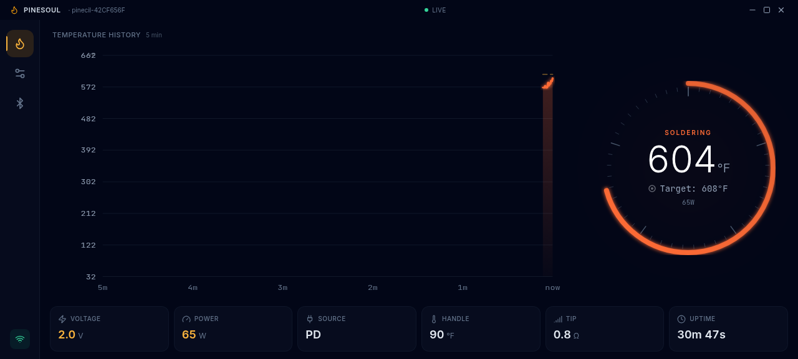
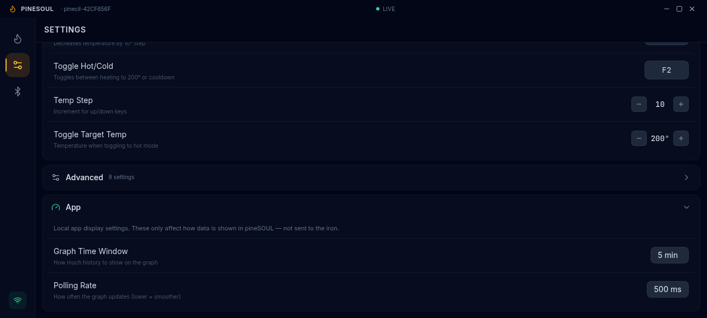
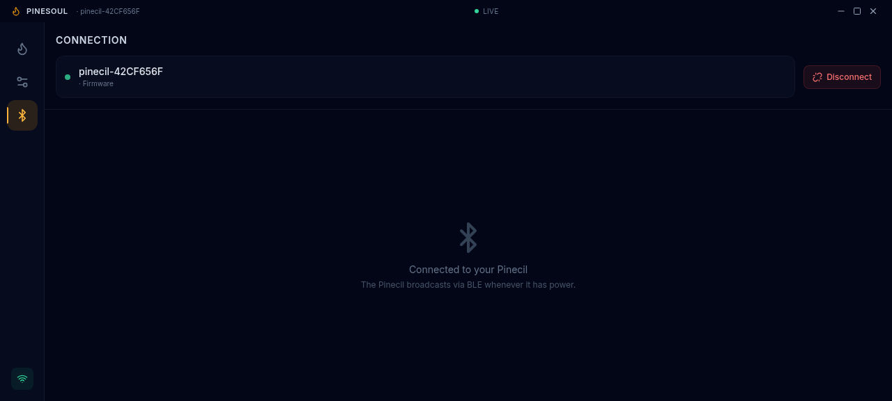

# pineSOUL 🔥

**Soul of your soldering iron** — A modern Pinecil V2 controller via Bluetooth.

<p align="center">
  
</p>

## Features

- **Live Temperature Monitoring** — Animated ring dial with real-time tip temp, target, and power draw
- **Temperature History Graph** — Smooth SVG graph with configurable time window (1–10 min)
- **Full Settings Control** — Soldering, sleep, power, display, and advanced settings organized by category
- **Keyboard Shortcuts** — Configurable hotkeys for temperature up/down and mode toggle
- **Bluetooth LE** — Automatic discovery and connection to Pinecil V2 via BLE (Electron: noble, PWA: Web Bluetooth)
- **Cross-Platform** — Desktop app (Windows, macOS, Linux) via Electron + Progressive Web App
- **PWA Installable** — Install from your browser on any HTTPS device
- **Dark Theme** — Polished, modern UI with glow effects and smooth animations
- **HiDPI Support** — Crisp rendering on high-DPI / Retina displays
- **Temperature Units** — Switch between °C and °F with live graph/dial updates
- **Offline Capable** — Service worker caches assets for offline access (PWA)

## Screenshots

| Control | Settings | Connect |
|---------|----------|---------|
|  |  |  |

## Quick Start

### Prerequisites

- Node.js 18+
- Bluetooth adapter (for connecting to your Pinecil)

### Development

```bash
git clone https://github.com/ryan0ezekiel/pineSOUL.git
cd pineSOUL
npm install
npm run dev          # Electron (loads Vite dev server)
npm run dev:pwa      # PWA only (browser, port 5174)
```

### Building

```bash
# Electron
npm run dist:linux   # AppImage, .deb, .rpm
npm run dist:win     # .exe installer + portable
npm run dist:mac     # .dmg
npm run dist:all     # All platforms

# PWA
npm run build:pwa    # Builds to dist-web/
npm run preview:pwa  # Serve PWA locally (port 5174)
```

### PWA (GitHub Pages)

The PWA auto-deploys on push to `master` via GitHub Actions.  
Live at: **https://ryan0ezekiel.github.io/pineSOUL/**

## Tech Stack

| Layer | Tech |
|-------|------|
| Desktop Shell | Electron 33 |
| UI Framework | React 18 + Vite 6 |
| Styling | Tailwind CSS 3 |
| Animations | Framer Motion |
| Icons | Lucide React |
| BLE (Desktop) | @abandonware/noble |
| BLE (PWA) | Web Bluetooth API |
| Packaging | electron-builder |

## Architecture

pineSOUL uses a single codebase for both Electron and PWA:

- **Electron**: Native BLE via `@abandonware/noble` in the main process, communicated through IPC (`preload.js`)
- **PWA**: Web Bluetooth API via `WebBleAdapter` class that implements the same interface as the Electron IPC bridge
- **Auto-loader** (`src/ble/index.js`): Detects the runtime environment and injects the correct adapter — no code changes needed in components

```
src/ble/
├── index.js          # Auto-loader: Electron → Web Bluetooth → mock (dev only)
├── web-bluetooth.js  # WebBleAdapter (PWA BLE implementation)
├── protocol.js       # Binary protocol parser (ESM, browser-compatible)
└── constants.js      # BLE UUIDs and Pinecil register maps (ESM)
```

## BLE Protocol

pineSOUL communicates with the Pinecil V2 over Bluetooth Low Energy using:

- **Settings Service** — Read/write all iron settings
- **Live Data Service** — Real-time telemetry stream (temp, voltage, power, etc.)
- **Device Info** — Firmware version, device ID, power source

Supports both v2.20 and v2.21+ firmware — auto-detected from GATT service UUIDs.

Based on the [PineSAM](https://github.com/joric/PineSAM) BLE protocol specification.

## Project Structure

```
pineSOUL/
├── electron/              # Main process (Node.js / CommonJS)
│   ├── main.js            # Electron entry point + IPC handlers
│   ├── preload.js         # Context bridge for renderer
│   └── ble/               # Bluetooth Low Energy
│       ├── ble-manager.js # Device discovery + connection
│       ├── protocol.js    # Binary encode/decode
│       └── constants.js   # UUIDs, register maps
├── src/                   # Renderer process (React / ESM)
│   ├── App.jsx            # Main layout + navigation + hotkeys
│   ├── main.jsx           # React entry point
│   ├── index.css          # Global styles + glass effects
│   ├── constants.js       # Setting metadata + value limits
│   ├── hooks/
│   │   ├── usePinecil.js  # State management + BLE integration
│   ├── ble/               # PWA BLE adapter layer
│   │   ├── index.js       # Runtime auto-loader
│   │   ├── web-bluetooth.js # Web Bluetooth adapter
│   │   ├── protocol.js    # Browser-compatible parser
│   │   └── constants.js   # ESM BLE constants
│   └── components/
│       ├── TitleBar.jsx       # Custom title bar + PWA install button
│       ├── TemperatureDial.jsx # Animated SVG temperature ring
│       ├── TemperatureGraph.jsx # Live temperature history graph
│       ├── LiveDataPanel.jsx  # Live telemetry cards
│       ├── SettingsPanel.jsx  # Settings editor with groups
│       ├── ConnectionPanel.jsx # BLE device discovery
│       ├── ErrorBoundary.jsx  # React error boundary
│       └── Toast.jsx         # Toast notification system
├── public/                # PWA static assets
│   ├── manifest.json      # PWA manifest
│   ├── sw.js              # Service worker
│   └── icons/             # PWA icons (192, 512)
├── build/                 # Electron app icons
├── .github/workflows/
│   ├── build.yml           # Build & release (Linux, Windows, macOS)
│   └── deploy-pwa.yml     # Auto-deploy PWA to GitHub Pages
├── vite.config.js         # Vite config (Electron renderer)
├── vite.config.pwa.js     # Vite config (PWA standalone build)
└── package.json
```

## License

MIT
